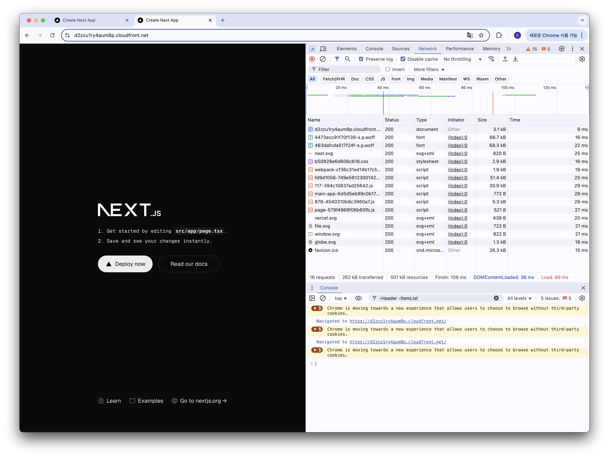

# 프론트엔드 배포 파이프라인

## 개요

GitHub Actions에 워크플로우를 작성해 다음과 같이 배포가 진행되도록 합니다.

 (사전작업: Ubuntu 최신 버전 설치)

1. Checkout 액션을 사용해 코드 내려받기
2. `npm ci` 명령어로 프로젝트 의존성 설치
3. `npm run build` 명령어로 Next.js 프로젝트 빌드
4. AWS 자격 증명 구성
5. 빌드된 파일을 S3 버킷에 동기화
6. CloudFront 캐시 무효화

## 주요 링크

- S3 버킷 웹사이트 엔드포인트: http://creco-hangehae-front-4th-chapter4-1.s3-website.ap-northeast-2.amazonaws.com
- CloudFrount 배포 도메인 이름: https://d2zcu1ry4aum8p.cloudfront.net

## 주요 개념

- GitHub Actions과 CI/CD 도구: CI/CD 를 통해 GitHub 의 Hook 이벤트가 발생했을 때 소스코드를 기반으로 여러가지 검증을 하거나 자동화된 배포 작업을 처리할 수 있습니다. 그 중에서도 GitHub Actions는 GitHub 에서 제공하는 도구로, 워크플로우를 작성할 수 있습니다.
- S3와 스토리지: S3 는 오브젝트 기반의 저장소입니다. 오브젝트 기반이기 때문에 우리가 흔히 알고있는 파일시스템과는 사뭇 다른 아키텍처로 동작되어 오해하기 쉽지만, 실제로는 디렉토리는 존재하지 않으며 Key 와 Object 만이 존재합니다. 단순히 파일의 내용과 위치만 기억하는 저장소라고 볼 수 있을 것 같습니다.
- CloudFront와 CDN: CloudFront 는 AWS 에서 제공하는 CDN 중 하나입니다. CDN 은 정적 리소스 (HTML/JS/CSS 혹은 그 외의 어떤 파일)를 Origin 에서 가져와 각 지역(엣지)에 캐싱해두고 응답을 내려주는 네트워크 서비스입니다. AWS 는 이런 엣지를 통해서 요청된 위치에 따라 더 가까운 엣지의 캐싱을 활용하기 때문에 Any Open 인 경우에 유리하게 정적 리소스를 사용할 수 있도록 도와줍니다.
- 캐시 무효화(Cache Invalidation): 위에서 말한 CDN 의 캐싱이 명시적으로 무효화되지 않는 한 캐싱된 리소스는 캐싱 정책에 따라 무효화를 하게 됩니다. 다만 공급자에 따라 캐싱정책을 따라갈 수도 있고 설정에 맞는 값으로 캐싱할 수도 있습니다. AWS CF 는 보통 캐싱정책을 준수하기 때문에 표준에 맞춰서 설정할 수 있습니다. 보통은 CDN 단에서의 캐싱은 매우 길게 잡고, 파일이 변경된 후 명시적으로 무효화 요청을 보내어 CDN의 캐싱을 제거해줍니다. 파이프라인을 잘 보면 업로드 된 이후에 그 파일을 기준으로 캐싱을 새로 쓰기 위해서 무효화 로직이 업로드 이후에 작성된 것을 알 수 있습니다.
- Repository secret과 환경변수: CI/CD에서 동작하는 Shell 코드에서 환경변수나 시크릿이 필요한 경우가 있습니다. 보통 API Token이나 Access Token 이 그 사례인데, 이번 프로젝트에서는 AWS S3 에 파일을 업로드하고 CF 에 무효화 요청을 보내는 AWS_ACCESS_KEY_ID/AWS_SECRET_ACCESS_KEY 가 사용이 되어야합니다. 나머지 값은 사실 환경변수일 필요도 없지만, 유연하게 교체할 수 있다는 점에서 환경변수로 관리되도록 설정한 것 같습니다. (다만 CI 에서 *으로 표기되어 디버깅하기 어렵다는 단점은 존재할 것 같습니다.)

## CDN과 성능최적화

### CDN 적용 전 네트워크 탭

### CDN 적용 후 네트워크 탭

- 전체적으로 내려받는 Size 가 줄었습니다.
- 바로 br 압축 기술이 적용되었기 때문입니다.

- 이후에도 학습자료에 나와있던 "Host Single Page Applications (SPA) with Tiered TTLs on CloudFront and S3"를 참고해서 js / css / woff / 그외에 대해 캐싱정책을 다르게 수정했습니다.

- 이를 통해 실제로 CDN 에 저장되는 캐싱 기간을 늘릴 수 있고, 같은 유저에 대해서 브라우저단 캐싱이 생기기 때문에 두번 재 접속부터는 매우 빠르게 접속이 가능합니다.
